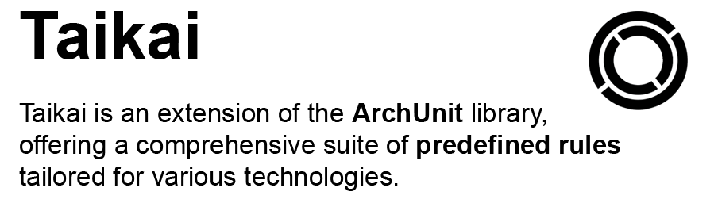

#



*Taikai* extends the capabilities of the popular ArchUnit library by offering a comprehensive suite of predefined rules tailored for various technologies. It simplifies the enforcement of architectural constraints and best practices in your codebase, ensuring consistency and quality across your projects.

[Get Started](./documentation){ .md-button .md-button--primary }
[View on GitHub :simple-github:](https://github.com/enofex/taikai){ .md-button }

## Example Usage

```java
class ArchitectureTest {

  @Test
  void shouldFulfilConstraints() {
    Taikai.builder()
        .namespace("com.company.project")
        .java(java -> java
            .noUsageOfDeprecatedAPIs()
            .classesShouldImplementHashCodeAndEquals()
            .methodsShouldNotDeclareGenericExceptions()
            .utilityClassesShouldBeFinalAndHavePrivateConstructor()
            .imports(imports -> imports
                .shouldHaveNoCycles()
                .shouldNotImport("..internal..")
                .shouldNotImport(junit4()))
            .naming(naming -> naming
                .classesShouldNotMatch(".*Impl")
                .methodsShouldNotMatch("^(foo$|bar$).*")
                .fieldsShouldNotMatch(".*(List|Set|Map)$")
                .constantsShouldFollowConventions()
                .interfacesShouldNotHavePrefixI()))            
        .test(test -> test
            .junit(junit -> junit
                .classesShouldNotBeAnnotatedWithDisabled()
                .methodsShouldNotBeAnnotatedWithDisabled()))
        .logging(logging -> logging
            .loggersShouldFollowConventions(Logger.class, "logger", List.of(PRIVATE, FINAL)))
        .spring(spring -> spring
            .noAutowiredFields()
            .boot(boot -> boot
                .applicationClassShouldResideInPackage())
            .configurations(configuration -> configuration
                .namesShouldEndWithConfiguration()
                .namesShouldMatch("regex"))
            .controllers(controllers -> controllers
                .shouldBeAnnotatedWithRestController()
                .namesShouldEndWithController()
                .namesShouldMatch("regex")
                .shouldNotDependOnOtherControllers()
                .shouldBePackagePrivate()))
        .services(services -> services
            .namesShouldEndWithService()
            .shouldBeAnnotatedWithService())
        .repositories(repositories -> repositories
            .namesShouldEndWithRepository()
            .shouldBeAnnotatedWithRepository())
        .build()
        .check();
  }
}
```

## Sponsors

If *Taikai* has helped you save time and money, I invite you to support my work by becoming a
sponsor.
By becoming a [sponsor](https://github.com/sponsors/mnhock), you enable me to continue to improve
Taikai's capabilities by fixing bugs immediately and continually adding new useful features. Your
sponsorship plays an important role in making *Taikai* even better.

## Backers

The Open Source Community and [Enofex](https://enofex.com) 

## License

See [LICENSE](https://github.com/enofex/taikai/blob/main/LICENSE).
